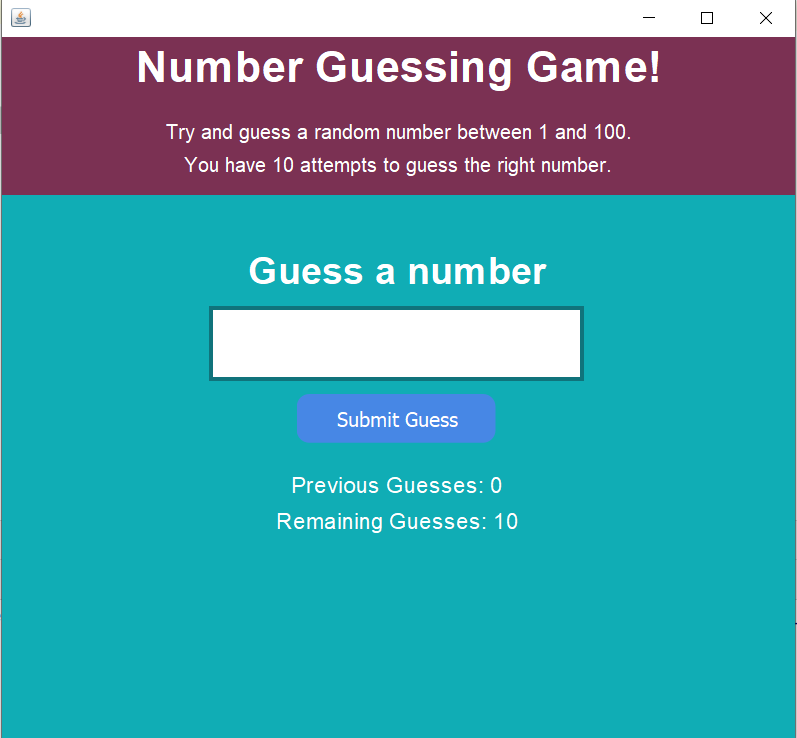

# Task01-Number-Guessing-Game

## Description

This is the first task of the CodSoft Internship Program. It's a simple number guessing game developed in Java using the Swing framework. The user is presented with a graphical user interface where they can guess a randomly generated number. The game provides feedback on whether the guess is too high or too low, helping the player to narrow down their guess until they find the correct number.

## Features

- Random number generation using the `java.util.Random` library.
- Custom `RoundedButton` class for a visually appealing user interface.
- Utilization of Border and Box Layouts for arranging components.
- Interactive feedback to guide the user's guesses.

## Prerequisites

- Java JDK 17.0.8 or higher
- IntelliJ IDEA 2023.2.1 (Ultimate Edition) or any compatible IDE

## Usage

1. Clone the repository or download the project files.
2. Open the project in IntelliJ IDEA or your preferred IDE.
3. Run the application from the main class.
4. Enjoy playing the number guessing game!

## Screenshots

  

## Contributing

Contributions to the project are welcome. If you find any issues or would like to add new features, feel free to submit a pull request.
